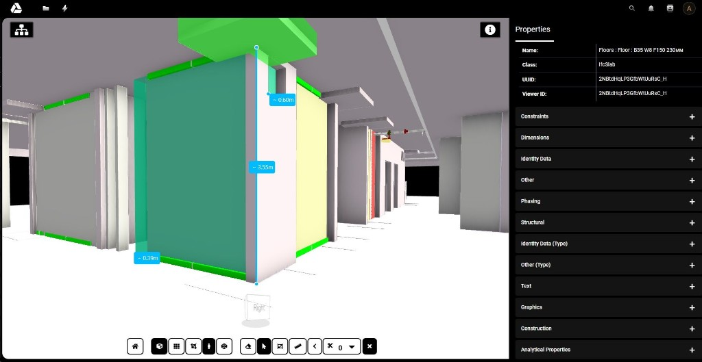

# IFC Viewer for Nextcloud



A Nextcloud app for viewing IFC building models in the browser, powered by [xeokit-bim-viewer](https://github.com/xeokit/xeokit-bim-viewer) **2.7.1**.

IFC files are converted server-side to XKT. The model is then displayed in a full-screen 3D viewer with an object tree, property inspector, section planes, and measurements. Public Nextcloud share links are supported for anonymous viewing.


## Features

- Open `.ifc` files from **Files** or via **Direct Editing**
- Server-side IFC → XKT conversion (`fast10` pipeline, `@xeokit/xeokit-convert`)
- Full BIM UI: Explorer, Properties, toolbar, NavCube
- 3D navigation: orbit, pan, zoom, first-person mode
- Keyboard controls: **WASD** move, **Q/E** rotate, **Z/X** up/down
- Section planes and distance/angle measurements
- Storey tree with show/hide per branch
- Context menu: hide/show, X-Ray, selection
- Public share links with a standalone viewer page
- Localization: English and Russian

## Requirements

| Component | Version |
|-----------|---------|
| Nextcloud | 32–33 |
| PHP | 8.1+ (8.2+ recommended) |
| Node.js | 18+ (converter) |
| npm | 9+ |

The web server user (e.g. `www-data`) must be able to run `node` and write to Nextcloud appdata (conversion cache). RAM requirements depend on IFC model size.

## Installation

### 1. Clone into Nextcloud `apps/`

```bash
cd /var/www/nextcloud/apps
git clone https://github.com/georgenovak97/ifcviewer.git ifcviewer
cd ifcviewer
```

### 2. Install converter dependencies

```bash
cd tools
npm ci
cd ..
```

### 3. Enable the app

```bash
sudo -u www-data php /var/www/nextcloud/occ app:enable ifcviewer
sudo -u www-data php /var/www/nextcloud/occ upgrade
```

### 4. Set permissions

```bash
sudo chown -R www-data:www-data /var/www/nextcloud/apps/ifcviewer
```

### 5. (Optional) Run tests

```bash
composer install
./vendor/bin/phpunit -c tests/phpunit.xml
```

## Usage

1. Upload an `.ifc` file to Nextcloud Files.
2. Click the file — conversion starts automatically, then the viewer opens.
3. For anonymous access, create a public share link in Nextcloud.

While the model is loading, a progress dialog shows the file name, percentage, status messages, and keyboard hints.

## Project structure

```
ifcviewer/
├── appinfo/                  # App metadata and routes
│   ├── info.xml
│   └── routes.php
├── config/                   # MIME mappings (model/ifc, application/x-ifc)
├── css/                      # Viewer and xeokit styles
├── js/
│   ├── viewer-boot.mjs       # Entry point (dynamic import)
│   ├── viewer-init.mjs       # Main BIM UI logic
│   ├── xeokit-adapter.mjs    # Adapter for xeokit private APIs
│   ├── files-ifc.js          # Nextcloud Files integration
│   └── public.js             # Public share page hooks
├── l10n/                     # Translations (en, ru)
├── lib/
│   ├── AppInfo/              # Bootstrap, DI, event listeners
│   ├── BackgroundJob/        # Background conversion (fallback path)
│   ├── Command/              # occ ifcviewer:convert
│   ├── Controller/           # Viewer, API, BIM API
│   ├── Listener/             # Files, sharing, direct editor
│   ├── PublicShare/          # Public share template provider
│   ├── Service/              # ConvertService, FileService
│   └── Exception/
├── templates/                # viewer.php, error.php
├── tests/                    # PHPUnit unit tests
├── tools/
│   ├── convert-ifc.mjs       # IFC → XKT converter
│   ├── merge_ifc.py          # Optional IFC merge utility
│   └── package.json
├── revit-export-config/      # Revit → IFC export presets for xeokit
├── review/                   # Internal audit notes
├── composer.json
└── README.md
```

## BIM API

The viewer uses a BIM API compatible with xeokit-bim-viewer:

| Method | Path | Description |
|--------|------|-------------|
| GET | `/api/bim/{fileId}/project` | Project metadata |
| POST | `/api/bim/{fileId}/prepare` | Start or wait for conversion |
| GET | `/api/bim/{fileId}/status` | Conversion status |
| GET | `/api/bim/{fileId}/geometry` | XKT geometry |
| GET | `/api/bim/{fileId}/properties/{objectId}` | Object properties |

Public share routes use the same endpoints under `/api/bim/s/{token}/`.

## Merging IFC files (`merge_ifc.py`)

Use `tools/merge_ifc.py` when you need **one combined IFC** from several source models (e.g. disciplines exported separately from Revit).

Before merging, the script renames spatial roots (`IfcProject`, `IfcSite`, `IfcBuilding`) using each file’s **basename** (`file1.ifc` → label `file1`). In the viewer **Explorer** tree, you then see meaningful source names instead of repeated generic labels.

### Prerequisites

```bash
cd tools
python3 -m pip install -r requirements.txt
```

Requires **Python 3.9+** and two packages: `ifcopenshell` and `ifcpatch`.

### Basic usage

```bash
cd tools

# output path first, then inputs
python3 merge_ifc.py merged.ifc arch.ifc struct.ifc mep.ifc

# explicit output flag
python3 merge_ifc.py -o merged.ifc arch.ifc struct.ifc

# merge all IFC files in the current folder (globs work even on Windows PowerShell)
python3 merge_ifc.py -o merged.ifc *.ifc
```

### Input list from a file

Create `sources.txt` (one path per line, `#` for comments):

```text
# Discipline exports
arch.ifc
struct.ifc
mep.ifc
```

Then run:

```bash
python3 merge_ifc.py --list sources.txt -o merged.ifc
```

You can combine `--list` with extra paths on the command line.

### Output

| File | Description |
|------|-------------|
| `merged.ifc` | Combined model ready for upload |
| `merged.ifc.merge.json` | Manifest: source filenames, labels, building GUIDs |

Example console output:

```text
[1/3] labeled arch.ifc -> arch
[2/3] labeled struct.ifc -> struct
[3/3] labeled mep.ifc -> mep
Merging 3 models into merged.ifc ...
Done: merged.ifc
Manifest: merged.ifc.merge.json
```

### Use in Nextcloud

1. Upload `merged.ifc` to Nextcloud Files.
2. Open it in IFC Viewer — the server converts it to XKT (cache refreshes on re-convert).
3. In **Explorer**, each former source file appears under its label.

**Tips**

- You need **at least two** unique input files.
- Duplicate paths are skipped automatically.
- Large models may take several minutes to merge; run on a machine with enough RAM.
- The manifest is for traceability only; the viewer does not read `.merge.json`.

## Development

### Deploy changes to a running server

```bash
# after editing the repo
sudo cp -r js css templates appinfo lib /var/www/nextcloud/apps/ifcviewer/
sudo chown -R www-data:www-data /var/www/nextcloud/apps/ifcviewer
sudo -u www-data php /var/www/nextcloud/occ upgrade
```

Bump `<version>` in `appinfo/info.xml` on each release so Nextcloud and browsers pick up new assets.

### Manual conversion

```bash
cd tools
node convert-ifc.mjs -s model.ifc -o model.xkt
```

### Revit export

For best results, use the export presets in `revit-export-config/` (IFC2x3, triangulation, recommended property sets).

## Security

- Content Security Policy is applied only on viewer pages
- Public `prepare` endpoint is rate-limited
- Conversion errors are sanitized for anonymous users
- Do not commit secrets, conversion cache, or large sample IFC files

## License

[AGPL-3.0-or-later](https://www.gnu.org/licenses/agpl-3.0.html) — see `composer.json`.

## Author

[georgenovak97](https://github.com/georgenovak97)
